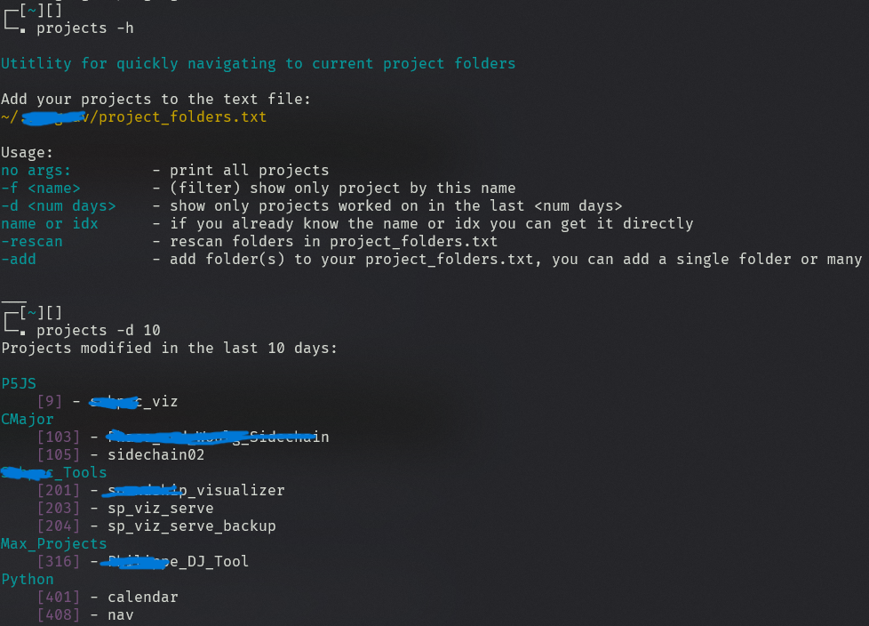

# PROJ NAV
Quickly navigate between project folders

### Usage
```
no args:         - print all projects
-f <name>        - (filter) show only project by this name
-d <num days>    - show only projects worked on in the last <num days>
name or idx      - if you already know the name or idx you can get it directly
-rescan          - rescan folders in project_folders.txt
-add             - add folder(s) to your project_folders.txt, you can add a single folder or many

examples:
List all projects modified in the last 10 days
    projects -d 10
Go to project called "sickassproj"
    projects_go sickassproj
Get project at index 302
    projects 302
Show only the projects in a particular project folder
    projects -f goodfolder
Go to main project folder for "goodfolder" project
    projects_go goodfolder
```

### project_folders.txt
```
Add the paths to the folders where your projects are to project_folders.txt
or you can use the -add option
make sure to -rescan if you edit project_folders.txt manually
```

### .bashrc
Modify add_to_bashrc to have the correct path to proj_nav, I keep mine in ~/.projnav so I would do
```
... previous lines
function run_projects_func() {
        python /home/gregtemp/.projnav/proj_nav.py "$@"
}

function go_projects_func() {
        command=$(python /home/gregtemp/.projnav/proj_nav.py "$@")
... rest of the file
```

Add the contents of add_to_bashrc to your .bashrc file.
``` 
cat add_to_bashrc >> ~/.bashrc
```

## Screenshot!
Some project names are "redacted" haha (in blue)




